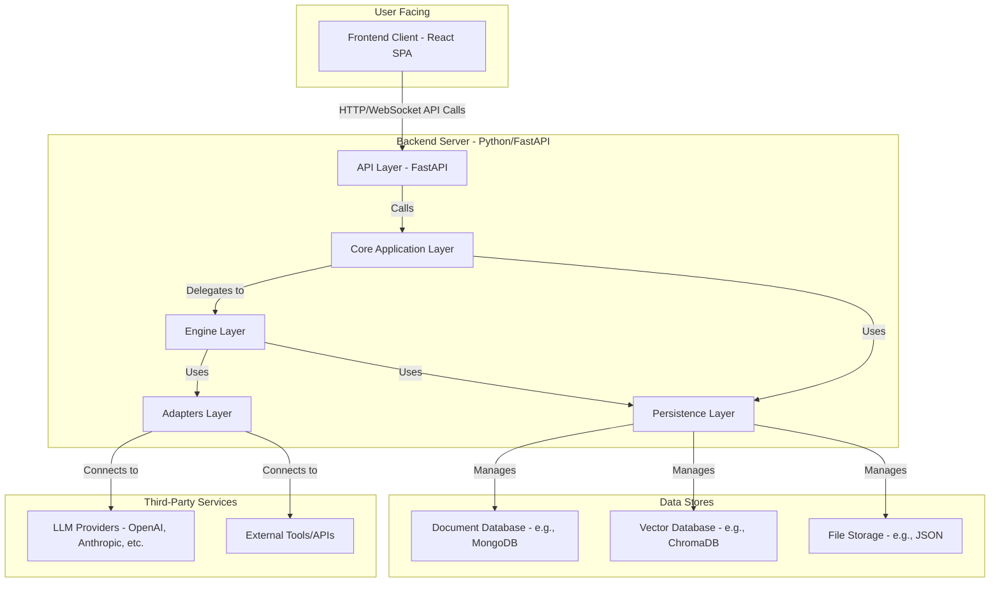
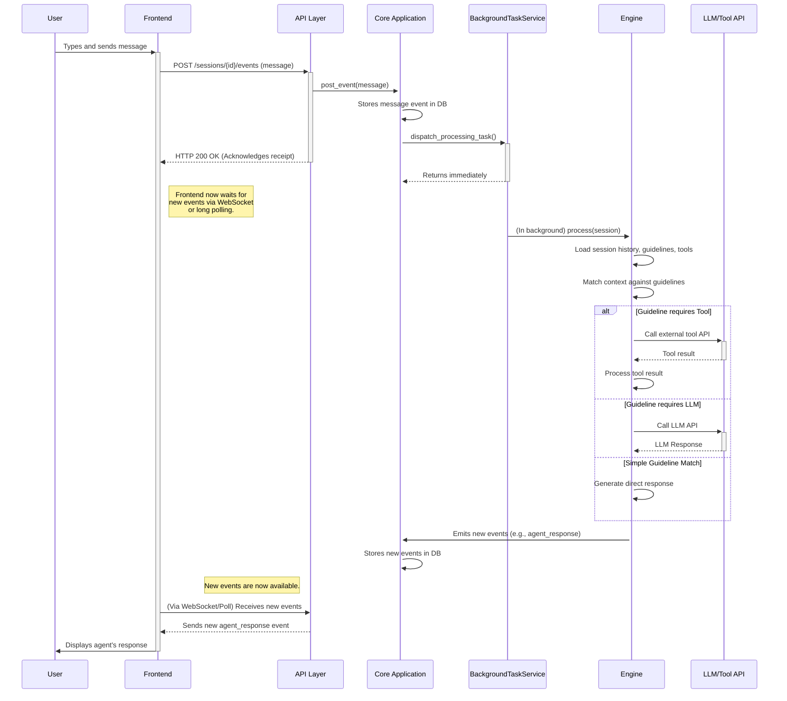

# Parlant Documentation: 02 - Full Architecture Analysis

**Version:** 3.0.1
**Timestamp:** 2025-08-19 10:25:40.394281

---

## 1. Complete System Architecture

Parlant is designed as a modern, multi-layered, full-stack application. Its architecture emphasizes separation of concerns, scalability, and maintainability. The high-level components are the Frontend Client, the Backend Server, Data Stores, and external Third-Party Services.

### High-Level Architectural Diagram

### Component Relationships

-   **Frontend Client:** A React Single-Page Application (SPA) that provides the user interface for chatting with agents and potentially for configuration. It communicates with the backend via a RESTful API and WebSockets for real-time updates.
-   **Backend Server:** The core of the application, built with Python and FastAPI. It is composed of several distinct layers:
    -   **API Layer (`src/parlant/api`):** Exposes all functionality through a well-defined set of HTTP endpoints. It handles request validation, authentication, authorization, and serialization. It is responsible for routing requests to the appropriate service in the core application layer.
    -   **Core Application Layer (`src/parlant/core/application.py`):** The central orchestrator. It handles high-level business logic, such as managing chat sessions and coordinating asynchronous background tasks. It acts as a bridge between the API layer and the underlying engine.
    -   **Engine Layer (`src/parlant/core/engines`):** The "brain" of the agent. This layer is responsible for the core reasoning process: receiving conversational events, matching them against Guidelines and Journeys, deciding when to call tools, and generating responses. It is designed as a swappable interface (`Engine`) with a primary implementation (`alpha/engine.py`).
    -   **Adapters Layer (`src/parlant/adapters`):** A crucial layer for decoupling the core application from external services. It contains specific implementations (adapters) for connecting to different LLM providers, databases, and vector stores. This makes the system highly extensible.
    -   **Persistence Layer (`src/parlant/core/persistence`):** Provides an abstraction for all data storage operations. It defines interfaces for interacting with different types of databases (Document DB, Vector DB) and ensures that the core logic is not tied to a specific database technology.
-   **Data Stores:** Parlant is designed to work with multiple types of data stores. The persistence layer abstracts access to:
    -   **Document Database:** For storing core application data like agents, sessions, guidelines, and users. MongoDB is a supported option.
    -   **Vector Database:** For performing semantic search and similarity lookups, which is essential for guideline matching and RAG. ChromaDB and other in-memory options are supported.
    -   **File Storage:** A simple JSON-based file storage adapter is available, likely for lightweight deployments or testing.
-   **Third-Party Services:** The Adapters layer allows the Engine to connect to a wide array of external services:
    -   **LLM Providers:** To access the generative and understanding capabilities of models from OpenAI, Anthropic, Google, etc.
    -   **External Tools/APIs:** To give agents real-world capabilities, such as fetching weather data, checking order statuses, or searching a knowledge base.

## 2. Complete Data Flow Diagram (User Message to Agent Response)

This sequence diagram illustrates the end-to-end asynchronous data flow when a user sends a message.

## 3. Every External Dependency Mapped and Explained

This table details the key dependencies listed in `pyproject.toml` and their role in the architecture.

| Dependency                  | Version     | Purpose                                                                                                                              |
|-----------------------------|-------------|--------------------------------------------------------------------------------------------------------------------------------------|
| **`fastapi`**               | `0.115.12`  | The core web framework for building the high-performance, asynchronous API layer.                                                    |
| **`uvicorn`**               | `0.32.1`    | The ASGI server used to run the FastAPI application.                                                                                 |
| **`lagom`**                 | `2.6.0`     | A dependency injection container used to manage the creation and wiring of components, promoting loose coupling and testability.     |
| **`structlog`**             | `24.4.0`    | Provides structured logging, which is essential for observability and debugging in a complex, asynchronous system.                 |
| **`openai`**                | `1.45.0`    | The official client library for interacting with OpenAI's LLM APIs (GPT-4, etc.). Used by the OpenAI adapter.                        |
| **`anthropic`**, **`google-genai`**, etc. | various     | Client libraries for other LLM providers, used by their respective adapters. These are optional installs.                       |
| **`chromadb`**              | `1.0.15`    | A client for the Chroma vector database, used for semantic search and similarity matching of guidelines.                               |
| **`pymongo`**               | `4.11.1`    | The client library for MongoDB, used by the MongoDB adapter for document storage. This is an optional install.                       |
| **`aiopenapi3`**            | `0.8.1`     | A library for parsing OpenAPI (Swagger) specifications. Used by the tool integration service to dynamically create clients for external APIs. |
| **`networkx`**              | `3.3`       | A graph theory library. Likely used to manage the complex relationships (e.g., `ENTAILMENT`) between different guidelines.             |
| **`pytest`** / **`pytest-bdd`** | `8.0.0` / `7.1.2` | The testing framework. The use of `pytest-bdd` indicates a Behavior-Driven Development approach, with tests written in Gherkin (`.feature` files). |
| **`ruff`** / **`mypy`**      | `0.5.6` / `1.16.0` | Code quality tools. `ruff` is used for linting and formatting, and `mypy` is used for static type checking to improve code robustness. |
| **`python-dotenv`**         | `1.0.1`     | Used to load environment variables from a `.env` file during development, for managing secrets and configuration.                    |

## 4. Full Security Architecture Analysis

The Parlant architecture incorporates several layers of security best practices.

-   **Authorization Framework:** The system has a dedicated, fine-grained authorization component (`src/parlant/api/authorization.py`). It uses an `AuthorizationPolicy` class that checks if a given request has the necessary permissions for a specific `Operation` (e.g., `ACCESS_API_DOCS`, `CREATE_AGENT`). This policy is injected into the API routers and checked at the beginning of relevant API calls.
-   **API Key Management:** While not explicitly detailed in the code reviewed, the presence of `python-dotenv` and the nature of the application imply that sensitive information like API keys for LLM providers and database credentials are managed via environment variables, which is a standard security practice. They are not hardcoded in the source.
-   **Middleware:**
    -   **CORS:** The `CORSMiddleware` is configured, but for production, the `allow_origins=["*"]` setting should be replaced with a specific list of allowed frontend domains to prevent cross-site request forgery (CSRF) from untrusted sites.
    -   **Input Validation:** FastAPI, in conjunction with Pydantic, provides automatic request validation. If an API call is made with malformed or incorrect data types, it is rejected at the edge with a `422 Unprocessable Entity` error, preventing invalid data from reaching the core logic.
-   **Rate Limiting:** The code defines a `RateLimitExceededException`. This suggests that a rate-limiting policy is in place to protect the API from denial-of-service (DoS) attacks or abuse.

## 5. Complete Error Handling Architecture

The error handling architecture is centralized and robust, leveraging FastAPI's exception handling capabilities.

-   **Custom Exception Handlers:** In `src/parlant/api/app.py`, specific exception handlers (`@api_app.exception_handler(...)`) are defined for custom, business-logic-related exceptions:
    -   `RateLimitExceededException`: Returns a `429 Too Many Requests`.
    -   `AuthorizationException`: Returns a `403 Forbidden`.
    -   `ItemNotFoundError`: Returns a `404 Not Found`.
-   **Global Exception Handler:** A catch-all `Exception` handler is in place to handle any unexpected server errors. It logs the full traceback for debugging purposes and returns a generic `500 Internal Server Error` to the client, avoiding the leak of sensitive stack trace information.
-   **Asynchronous Exception Handling:** A custom `AppWrapper` and middleware are implemented to specifically handle `asyncio.CancelledError`. This is critical in an async application to prevent client disconnections from crashing the server process, instead allowing the task to be gracefully terminated.
-   **Structured Logging:** All exceptions are logged using a structured logger (`structlog`), which includes correlation IDs. This allows for effective tracing and debugging of errors through the entire request lifecycle.
---
