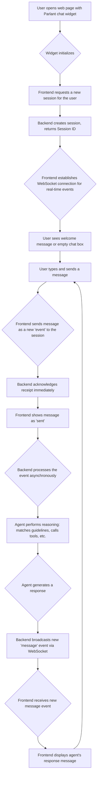

# Parlant Documentation: 04 - Complete Workflow Documentation

**Version:** 3.0.1
**Timestamp:** 2025-08-19 10:29:21.752522

---

## 1. Every Possible User Journey Mapped

This section documents the primary user journey of interacting with a Parlant agent through the standard web chat interface.

### Standard Conversation Workflow

### Edge Case: Human Handoff Workflow

This workflow is triggered when a tool call initiates a human handoff.

1.  **Trigger:** The user's request matches a guideline that calls a specific "human handoff" tool.
2.  **Tool Execution:** The tool's logic is executed on the backend.
3.  **Control Payload:** The tool returns a result containing a special `control` payload: `{"control": {"mode": "manual"}}`.
4.  **Mode Switch:** The `AlphaEngine` detects this payload and updates the session's mode from "automatic" to "manual".
5.  **AI Paused:** The `AlphaEngine.process` method now short-circuits. It will no longer attempt to generate responses for this session.
6.  **Notification:** A notification is sent to a human agent support dashboard (this part of the system is external to the core framework but is a common integration).
7.  **Human Intervention:** A human agent can now chat with the user through their own interface, which would post events to the same session.
8.  **Handoff Back:** The human agent, upon resolving the issue, can trigger an action (e.g., click a "Resolve" button) that calls a tool to switch the session mode back to "automatic". The AI agent resumes normal operation.

## 2. All Process Flows from Start to Completion

### API Interaction Flow

This details the sequence of API calls made by the frontend (`api.ts` and other components) to the backend for a standard chat session.

| Step | Action | HTTP Method | Endpoint | Request Body (Example) | Backend Response |
|---|---|---|---|---|---|
| 1 | Create a new session | `POST` | `/sessions` | `{ "agent_id": "weather_bot_123", "allow_greeting": true }` | The full `Session` object, including the new `session_id`. |
| 2 | Send a user message | `POST` | `/sessions/{session_id}/events` | `{ "kind": "message", "source": "CUSTOMER", "data": { "message": "What's the weather?" } }` | `200 OK` (acknowledgment). The actual response comes via WebSocket. |
| 3 | Rename a session | `PATCH` | `/sessions/{session_id}` | `{ "title": "My Weather Chat" }` | `200 OK` (or the updated Session object). |
| 4 | Delete a session | `DELETE` | `/sessions/{session_id}` | (None) | `200 OK`. |
| 5 | Get session history | `GET` | `/sessions/{session_id}/events` | (None) | A list of all `Event` objects for the session. |

### WebSocket Flow

For real-time communication, the frontend opens a WebSocket connection to the `/logs/ws/{client_id}` endpoint.

1.  **Connection:** The frontend establishes a WebSocket connection upon initialization.
2.  **Subscription:** The client sends a message to subscribe to events for a specific `session_id`.
3.  **Event Broadcasting:** As the `AlphaEngine` processes and emits new events (e.g., `status`, `message`, `tool_result`), the `WebSocketLogger` on the backend receives these events and pushes them to the connected client.
4.  **Client-Side Handling:** The frontend's WebSocket hook (`useWebSocket.ts`) listens for these incoming messages and updates the application's state accordingly, causing new messages and status updates to render in the UI.

## 3. Complete Error Handling Procedures for All Scenarios

| Scenario | Trigger | System Workflow | User-Facing Outcome |
|---|---|---|---|
| **Invalid API Request** | Frontend sends a request with a missing required field (e.g., no `agent_id` when creating a session). | 1. FastAPI's Pydantic integration automatically validates the incoming request. 2. It fails validation before hitting any application logic. 3. The server immediately returns an HTTP `422 Unprocessable Entity` response with details about the validation error. | The request fails silently in the background. The UI might show a generic "Error, please try again" message. No session is created. |
| **Tool Execution Fails** | A tool (e.g., an external weather API) is called, but the external service is down and throws an exception. | 1. The `ToolCaller._run_tool` method catches the exception. 2. It logs the full error traceback for debugging. 3. It creates a `ToolCallResult` with an error message in the `metadata` field. 4. This result is passed back to the `AlphaEngine`. 5. The `MessageGenerator` now has the context that the tool failed. It will typically compose a response informing the user of the failure (e.g., "I'm sorry, I couldn't fetch the weather information right now."). | The user receives a graceful message explaining that the requested action could not be completed. They are not exposed to the technical error details. |
| **Missing Tool Parameter** | The agent needs to call a tool (e.g., `get_weather(city: str)`) but the user hasn't provided the city yet. | 1. The `ToolCallBatch` (using an LLM) determines that the `city` parameter is missing. 2. It returns a `MissingToolData` insight to the `AlphaEngine`. 3. The `MessageGenerator` receives this insight. 4. It generates a response specifically asking for the missing information (e.g., "I can help with that. What city are you in?"). | The user is prompted to provide the exact information the agent needs to proceed. This is a seamless clarification, not an error. |
| **Authorization Failure** | A user tries to access a resource they don't have permission for (e.g., another user's session). | 1. The request hits the API endpoint. 2. The `AuthorizationPolicy` middleware is executed. 3. The policy checks the user's identity against the resource's owner and denies access, throwing an `AuthorizationException`. 4. The custom exception handler in `app.py` catches this and returns an HTTP `403 Forbidden`. | The API request fails. The UI would likely show an "Access Denied" or similar error message. |

## 4. All State Management Workflows

-   **Session State:** The primary state is managed in the `Session` object in the database. This includes the full `history` of all events.
-   **Agent Turn State:** This is a more complex state managed by the `AlphaEngine` and persisted in the `Session` object's `agent_states` list.
    -   **`applied_guideline_ids`:** A list of guideline IDs that were successfully used to generate the response in a given turn. This is the primary mechanism to prevent the agent from repeating itself. Before matching, the engine can check this list and ignore already-applied guidelines.
    -   **`journey_paths`:** A dictionary mapping active `JourneyId`s to the path of nodes (`GuidelineId`s) that have been traversed within that journey. This allows the agent to know exactly where it is in a multi-step process and what the next step should be.
-   **Client-Side State:** The React frontend maintains its own state, which is a reflection of the session history received from the backend. It uses state management libraries (like Zustand or Redux, as inferred from the `store.ts` file) to keep the UI in sync with the events received via the API and WebSocket. When a new event arrives, it is appended to the local state, triggering a re-render of the chat log.
---
