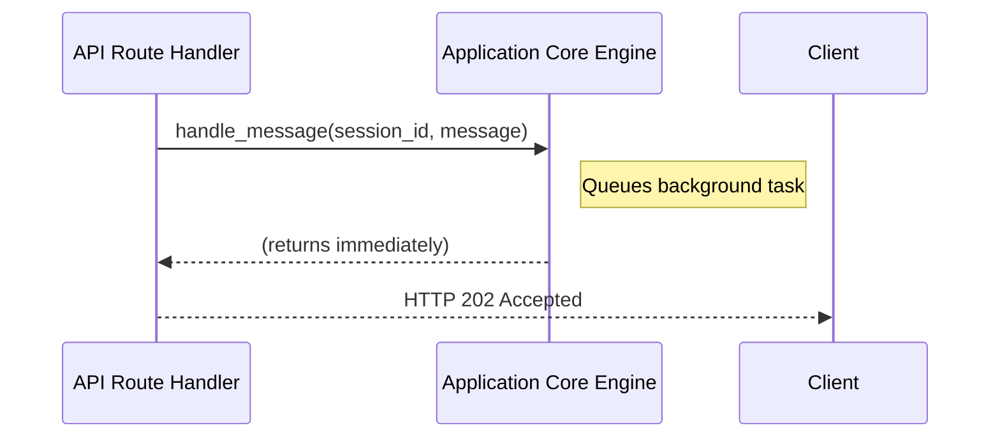
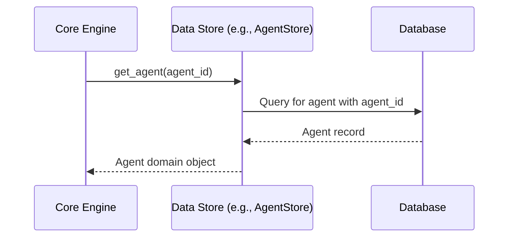

# Complete Interaction Sequence Analysis

## System Interaction Categories

### User-System Interactions
This section describes the interactions between an external client (like a web UI) and the Parlant API, primarily sourced from `docs/interactions.md`.

#### Interaction 1: User Sends a Message
**Interaction Trigger**: A user submits a message through a client application, which triggers an HTTP POST request to the Parlant API.
**System Response Sequence**: This interaction is split into a synchronous acknowledgement and an asynchronous response.
```
User POST → API Acknowledges (202) → Agent Processes (Async) → Agent Message Saved → Client Long Poll Receives Event
↓           ↓                       ↓                         ↓                       ↓
[Send Msg]  [Return Msg ID]         [Match Journey/Guideline] [Notify Listener]       [Render New Msg]
```
**Detailed Sequence Steps**:
1. **User Action Reception**:
   - **Entry Point**: The `POST /sessions/{session_id}/events` route handler, likely defined in `src/parlant/api/sessions.py`.
   - **Input Processing**: The request's JSON body is parsed and validated into a Pydantic model.
   - **Validation**: The request is validated against the Pydantic schema and any `AuthorizationPolicy` rules.
2. **System Processing**: The API handler persists the user's message to the data store and triggers an asynchronous background task to generate the agent's response. The initial HTTP request returns immediately.
3. **Response Generation**: The immediate, synchronous response is an HTTP `202 Accepted` containing the unique ID of the user's newly created message event. The agent's actual reply is delivered later.

#### Interaction 2: Client Fetches New Messages
**Interaction Trigger**: The client application needs to check for new messages from the agent.
**System Response Sequence**: This is a long-polling mechanism.
```
Client GET (Long Poll) → API Waits on Listener → Event Occurs → Listener Notified → API Responds with Events
↓                        ↓                       ↓               ↓                   ↓
[Await Events]           [Hold Request Open]     [Agent Replies] [Release Waiter]    [Return JSON List]
```
**Detailed Sequence Steps**:
1. **Reception**: The client makes a `GET` request to the `/sessions/{session_id}/events` endpoint, including a `min_offset` query parameter to indicate the last message it has received.
2. **Processing**: The API handler checks for new events. If none are found, it registers a "waiter" with the `SessionListener` and holds the HTTP request open.
3. **Response Generation**: When a new event is saved for the session, the `SessionListener` is notified and releases the waiting request. The handler then queries the database for all events after the client's `min_offset` and returns them as a JSON array. If the request times out (e.g., after 60 seconds), it returns an empty array.

### Component-Component Interactions

#### Interaction 1: API Layer → Core Engine
**Interaction Purpose**: To delegate the complex business logic of a conversational turn to the central application engine.
**Interaction Method**: A direct Python method call. The `Application` object is retrieved from the `lagom` dependency injection container.
**Data Exchange**: The API layer passes validated data (like session ID and message content) to the `Application.handle_message()` method. The method call is "fire-and-forget"; it does not return the agent's response.
**Sequence Diagram**:


#### Interaction 2: Core Engine → Data Stores
**Interaction Purpose**: To persist new data (session events) or retrieve existing data (Agent configuration, conversation history).
**Interaction Method**: A direct method call on a data store object (e.g., `agent_store.get_agent(id)`).
**Data Exchange**: The Core Engine passes data objects to be saved or query parameters for retrieval. The Data Store returns domain model objects.
**Sequence Diagram**:


### External System Interactions

#### Integration 1: Parlant → LLM Provider (e.g., OpenAI)
**Integration Purpose**: To generate the agent's natural language responses.
**Integration Method**: An HTTPS POST request to the LLM provider's public API endpoint.
**Authentication**: An API key is included in the `Authorization` header of the request.
**Data Exchange Format**: JSON. Parlant sends a request body containing the prompt, model name, and other parameters. The LLM provider returns a JSON object containing the generated text.
**Complete Integration Flow**:
```
Core Engine → Prepare Prompt → Send Request → LLM API
↓             ↓                ↓              ↓
[Get Context] [Format String]  [HTTP POST]    [Process Request]
↓             ↓                ↓              ↓
[Use Response]← [Parse JSON]   ← [JSON Resp]  ← [Return Text]
```

### Asynchronous Interaction Patterns

#### Async Pattern 1: Agent Response Generation
**Trigger**: A call to `Application.handle_message()` from an API route handler.
**Queue Management**: The system uses `asyncio.create_task` to run the response generation logic in the background without blocking the main server process.
**Processing Logic**: The background task executes the entire workflow of intent matching, state execution, tool calls, and LLM prompting.
**Result Handling**: The final agent message is saved to the database. A notification is sent to the `SessionListener`, which in turn releases any long-polling requests waiting for updates on that session. There is no direct return value from the task to the original caller.
**Error Recovery**: An exception within the task is caught and logged. This might result in a specific "error" event being added to the session to notify the user that something went wrong.
