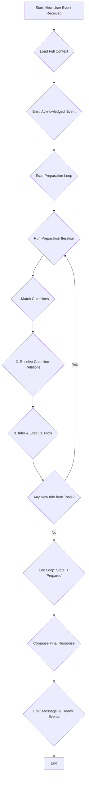

# Parlant Documentation: 06 - Complete Business Logic Analysis

**Version:** 3.0.1
**Timestamp:** 2025-08-19 10:28:32.128852

---

## 1. Core Engine Processing Algorithm

The business logic of the Parlant agent is embodied in the `AlphaEngine`'s core processing algorithm. This is not a simple linear script but a cyclical, iterative process designed to handle complex, multi-turn interactions involving external tools and dynamic context.

The algorithm's primary goal is to move the conversation from an "unprepared" state to a "prepared" state, at which point it can confidently generate a response.

### Processing Flowchart

### Algorithm Steps Explained

1.  **Load Context:** For any new user input, the engine first loads the entire relevant history and configuration: the agent's settings, the customer's profile, the full conversation history, and the current state of any active "Journeys".
2.  **Acknowledge:** The engine immediately informs the system it has "seen" the new input.
3.  **Preparation Loop:** This is the core reasoning cycle. The engine may loop through these steps multiple times per turn.
    a. **Match Guidelines:** The engine uses the `GuidelineMatcher` to perform a sophisticated search for all active rules. This is not a simple keyword search. It uses semantic search and LLM-powered analysis to find guidelines that are contextually relevant, even if they aren't explicitly mentioned.
    b. **Resolve Relations:** The initial set of matched guidelines is expanded by traversing a graph of relationships. For example, if a matched guideline "entails" another, that second guideline is also added to the active set.
    c. **Infer & Execute Tools:** The engine identifies which of the active guidelines require external tools. It uses the `ToolCaller` (often with an LLM) to determine the correct arguments for these tools based on the conversation, and then executes them.
    d. **Check for Stability:** If the tool calls produced new information, the context has changed. The loop repeats from step 3a to see if this new information activates any *new* guidelines. This iterative process is the key to the agent's ability to reason through multi-step tasks.
4.  **Compose Response:** Once the loop stabilizes (no new information is being generated), the engine has a final, definitive set of instructions. It passes these instructions to a `MessageGenerator` to compose the final text response.
5.  **Emit Events:** The final message is sent to the user, and the engine signals that it is "ready" for the next input.

## 2. Decision Matrices for Core Logic

### Guideline Matching Logic

The decision to activate a guideline is based on multiple strategies, resolved dynamically.

| Strategy Type | When It's Used | Business Logic | Example |
|---|---|---|---|
| **Observational** | For simple, direct guidelines. | A semantic search is performed to see if the user's utterance is closely related to the guideline's `condition`. | **Guideline:** "If user is angry, offer a discount." **Logic:** The user's message is analyzed for negative sentiment. |
| **Disambiguation** | When multiple guidelines could potentially apply. | An LLM is called with the context and the conflicting guidelines and is asked to choose the single most appropriate one. | **Guidelines:** 1) "Help with login," 2) "Help with password reset." **User:** "I can't get into my account." **Logic:** LLM is asked to disambiguate which help topic is more likely. |
| **Journey Node Selection** | To determine the next step in a predefined conversational flow. | The current state of the "Journey" is checked, and the guideline corresponding to the next node in the flow is activated. | **Journey:** "New User Onboarding." **State:** User just provided their name. **Logic:** The guideline for the "Ask for email" step is activated. |
| **Previously Applied** | To check if a rule has already been followed. | The system checks if a guideline was marked as "applied" in a recent turn to prevent repetitive behavior. | **Guideline:** "Offer a welcome discount." **Logic:** If the discount was already offered in a previous message, this guideline is suppressed. |

### Tool-Calling Logic

The decision to call a tool is explicit and rule-based, but the parameterization is dynamic.

| Condition | Action | Business Logic |
|---|---|---|
| A guideline with associated tools is matched. | `ToolCaller.infer_tool_calls` is invoked. | The system uses an LLM to generate the JSON arguments for the tool based on the conversation history and the tool's function signature. |
| The LLM fails to find a required parameter. | A `MissingToolData` insight is generated. | The engine's response generation phase will be informed that it needs to ask the user for the missing information. |
| The LLM generates a parameter with an invalid value (e.g., not in a list of choices). | An `InvalidToolData` insight is generated. | The engine's response generation phase will be informed that it needs to correct the user or ask for a valid choice. |
| A tool has a `freshness_rule` (e.g., a cron expression). | The `load_fresh_context_variable_value` function is called. | The system checks if the cached value for a variable is stale. If it is, the associated tool is automatically re-run to fetch fresh data. |

## 3. Validation Rules and Data Processing

-   **Tool Parameter Precedence:** When multiple tool parameters are missing or invalid, the one with the lowest `precedence` value is addressed first. This allows developers to define a logical order for clarification questions (e.g., ask for the city before asking for the specific street).
-   **Event Lifespan:** Tool results can have a `lifespan`.
    -   `session`: The result is saved permanently to the session history. This is for important data that should be remembered for the entire conversation.
    -   `response`: The result is only available for the current turn. This is for transient data that is only needed to compose the immediate response and can then be discarded.
-   **Agent State Management:** The engine maintains a list of `applied_guideline_ids` in the session's `agent_state`.
    -   **Purpose:** To prevent the agent from getting stuck in loops or repeating itself.
    -   **Logic:** After a response is generated, the `analyze_response` method checks which guidelines were successfully addressed in the final output. The IDs of these guidelines are added to the `applied_guideline_ids` list for the current turn. In subsequent turns, the Guideline Matcher will deprioritize or ignore guidelines that are already in this list.
    -   **Exception:** Guidelines marked with `continuous: true` in their metadata can be applied repeatedly.

## 4. Business Rules and Constraints

-   **Max Engine Iterations:** The engine has a configurable limit on how many times it can loop through the "preparation iteration" in a single turn. This is a critical safety constraint to prevent runaway loops in case of conflicting tool results or guidelines, ensuring the agent will always respond in a finite amount of time.
-   **Composition Mode:** Each agent has a `composition_mode` that dictates the final step of response generation.
    -   `FLUID`: The final set of guidelines and data is passed to a powerful LLM to be composed into a natural, "fluid" response.
    -   `CANNED_STRICT`: The system must choose from a predefined list of "canned responses". No generative AI is used. This is for use cases requiring maximum control and predictability.
    -   `CANNED_FLUID`: A hybrid mode where a canned response is used as a template, but an LLM can "fluidly" fill in the blanks.
-   **Manual Mode Handoff:** Tools can return a `control` payload in their result. If a tool returns `{"control": {"mode": "manual"}}`, the session's mode is immediately switched. This is the core business logic for enabling a human handoff. Once in "manual" mode, the `AlphaEngine.process` method will no longer execute the preparation loop, effectively pausing the AI until the mode is switched back.
---
